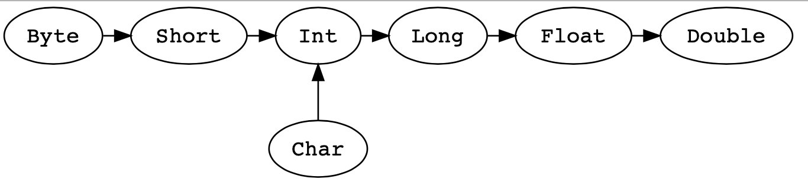

# Basic
* RELP
	- All commands
	```scala
	:help
	```
	- Show the history
	```scala
	:hi(story)
	```
	- Search the history
	```scala
	:h? <string>
	```
	- Edit history for reference
	```scala
	:e(dit) <line>   //palce that line in recent history
	```
	```scala
	:e(dit) <id>     //place that variable in recent history
	```
	> Then with a single up-arrow to edit/excute the code

* Variable
	- Immutable variable(constant)
	```scala
	val {variable_name}: {variable_type} = {variable_value}
	```
	- Mutable variable(var)
	```scala
	var {variable_name}: {variable_type} = {variable_value}
	```

* Type classes
	- Any
	> `Any` is the supertype of all types
	- AnyVal
	> `AnyVal` represents value types are non-nullable
		- BigDecimal, Double, Float
		- BigInt, Long, Int, Short, Byte
		- Char
		- Unit	//useful return type, like ()
		- Boolean
	- AnyRef
	> `AnyRef` represents reference types covers all non-value types
	- Nothing
	> 'Nothing' is a subtype of all types to signal non-termination(thrown exception, program exit, an infinite loop)
	- Null
	> 'Null' is a subtype of all `AnyRef` with single value `null`
	```scala
	var {variable_name} Any: = null    //initial with null value
	```
	- Type Casting
	